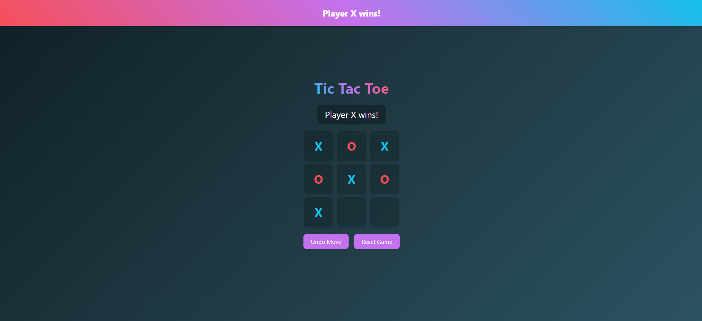

# 🎮 Tic Tac Toe Game with React ⚛️

 *(Add your screenshot here)*
## 🚀 Live Demo
You can check out the live version of the project [here](https://tic-tac-toe-game-red-kappa.vercel.app/).


A beautiful, responsive Tic Tac Toe game built with React, featuring:
- ✨ Light/dark mode toggle
- 🔄 Move history with undo functionality
- 🎨 Stunning gradients and animations
- 📱 Fully responsive design

## 🚀 Features

### 🎮 Gameplay
- 2️⃣ Two-player mode (X and O)
- 🔄 Undo moves (go back in game history)
- 🔄 Reset game at any time
- 🏆 Winner detection and draw handling

### 🎨 UI/UX
- 🌞/🌙 Light and dark mode toggle
- 🌀 Smooth animations with Framer Motion
- 🎨 Beautiful gradient backgrounds
- 📱 Fully responsive design (works on mobile & desktop)

### ⚙️ Tech Stack
- ⚛️ React with hooks
- ♻️ useReducer for state management
- 💅 styled-components for styling
- 🏃‍♂️ Framer Motion for animations
- 🧩 Component-based architecture

## 📦 Installation

1. Clone the repository:
```bash
git clone https://github.com/your-username/tic-tac-toe.git
Navigate to the project directory:

bash
cd tic-tac-toe
Install dependencies:

bash
npm install
Start the development server:

bash
npm start
Open your browser at:

text
http://localhost:3000
🛠️ Project Structure
text
tic-tac-toe/
├── src/
│   ├── components/         # React components
│   │   ├── Board.jsx      # Game board
│   │   ├── Controls.jsx   # Game controls
│   │   ├── Square.jsx     # Individual squares
│   │   └── ThemeToggle.jsx# Theme switcher
│   ├── constants/         # Game constants
│   │   └── game.js       # Game rules and initial state
│   ├── contexts/          # React contexts
│   │   └── GameContext.jsx# Game state context
│   ├── styles/           # Styling files
│   │   ├── GlobalStyles.js# Global styles
│   │   └── themes.js     # Theme configurations
│   ├── App.jsx           # Main application
│   └── index.jsx         # Entry point
├── public/               # Static files
└── package.json          # Project dependencies
🎨 Theme Configuration
The app includes two beautiful themes:

🌞 Light Theme
Soft blue/purple gradient

Clean, light interface

High contrast text

🌙 Dark Mode
Deep blue/green gradient

Dark interface for reduced eye strain

Vibrant accent colors

🎥 Animations
The game uses Framer Motion for smooth animations:

Button hover and tap effects

Game board entrance animation

Winner banner slide-in

Smooth theme transitions

🤝 Contributing
Contributions are welcome! Here's how:

Fork the project

Create your feature branch (git checkout -b feature/AmazingFeature)

Commit your changes (git commit -m 'Add some amazing feature')

Push to the branch (git push origin feature/AmazingFeature)

Open a Pull Request

📜 License
Distributed under the MIT License. See LICENSE for more information.

✉️ Contact
Your Name - @yourtwitter - youremail@example.com

Project Link: https://github.com/your-username/tic-tac-toe

🙏 Acknowledgments
React team

styled-components creators

Framer Motion team

Inspired by classic Tic Tac Toe games